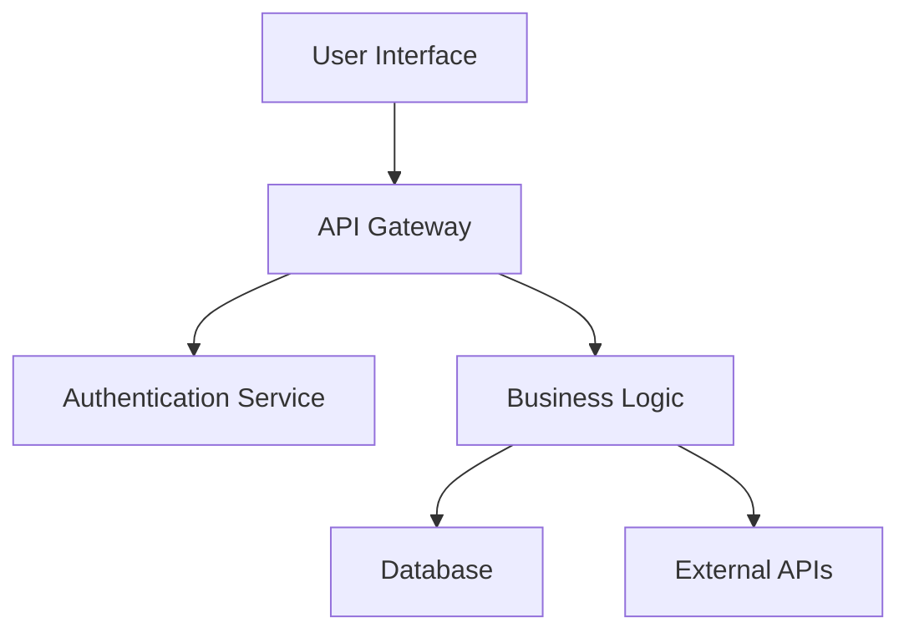
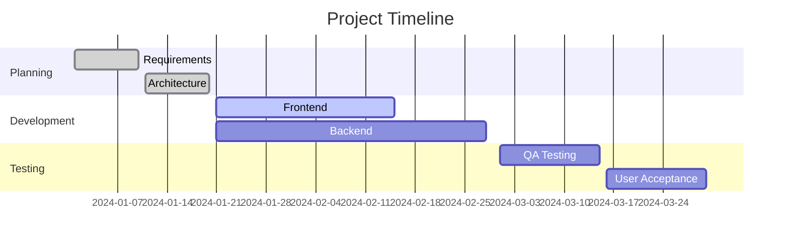
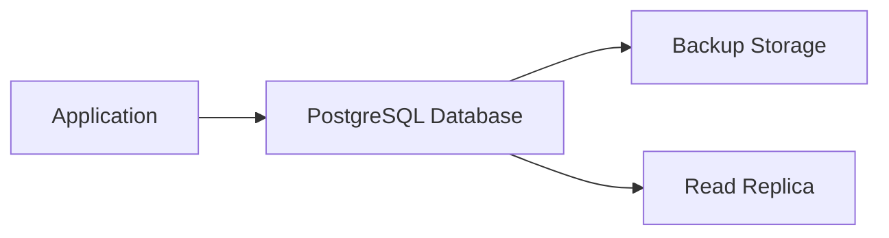
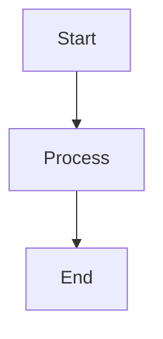

# Markdown to Word Converter - Usage Examples

This document provides detailed examples of how to use the Markdown to Word converter skill for various scenarios.

## Table of Contents

1. [Basic Usage](#basic-usage)
2. [Advanced Features](#advanced-features)
3. [Sample Markdown Documents](#sample-markdown-documents)
4. [Custom Templates](#custom-templates)
5. [Troubleshooting Examples](#troubleshooting-examples)

## Basic Usage

### Example 1: Simple Document Conversion

Convert a basic Markdown file to Word:

```bash
# Navigate to the skill directory
cd markdown-word-converter

# Convert README.md to Word
python scripts/convert.py README.md
```

**Result**: Creates `README.docx` with proper formatting and table of contents.

### Example 2: Custom Output Name

Specify a custom output filename:

```bash
python scripts/convert.py technical_specs.md -o "Technical Specification v2.0.docx"
```

**Result**: Creates a Word document with the specified name.

### Example 3: Multiple Files Conversion

Convert multiple files using a simple loop:

```bash
for file in *.md; do
    python scripts/convert.py "$file"
done
```

## Advanced Features

### Example 4: Document with Mermaid Diagrams

Convert a document containing Mermaid diagrams:

**Input (`project_flow.md`):**
```markdown
# Project Workflow

## System Architecture



## Development Process



## Implementation Details

The system uses modern web technologies...
```

**Command:**
```bash
python scripts/convert.py project_flow.md
```

**Result**: Word document with converted PNG images of the Mermaid diagrams.

### Example 5: Document with Tables and Code Blocks

**Input (`api_documentation.md`):**
```markdown
# API Documentation

## Endpoints

| Method | Endpoint | Description | Parameters |
|--------|----------|-------------|------------|
| GET | /api/users | Get all users | page, limit |
| POST | /api/users | Create user | userData |
| PUT | /api/users/:id | Update user | userData |
| DELETE | /api/users/:id | Delete user | - |

## Code Examples

### Python Example

```python
import requests

def get_users(page=1, limit=10):
    """Get users from API"""
    url = f"https://api.example.com/users?page={page}&limit={limit}"
    response = requests.get(url)
    return response.json()

# Usage
users = get_users(page=1, limit=20)
```

### JavaScript Example

```javascript
const fetch = require('node-fetch');

async function getUsers(page = 1, limit = 10) {
    const response = await fetch(`https://api.example.com/users?page=${page}&limit=${limit}`);
    return await response.json();
}

// Usage
const users = await getUsers(1, 20);
```

## Error Handling

Always handle API errors gracefully:
- Check response status codes
- Validate response data
- Implement retry logic
```

**Command:**
```bash
python scripts/convert.py api_documentation.md
```

**Result**: Formatted Word document with proper tables and code syntax highlighting.

## Sample Markdown Documents

### Example 6: Technical Report

```markdown
# Technical Report: Database Migration

## Executive Summary

This report outlines the process and results of migrating from MySQL to PostgreSQL...

## Table of Contents

- [Executive Summary](#executive-summary)
- [Background](#background)
- [Migration Process](#migration-process)
- [Results](#results)
- [Recommendations](#recommendations)

## Background

### Current System Architecture


### Target System Architecture



## Migration Process

### Phase 1: Preparation
1. **Data Analysis**
   - Schema review
   - Data volume assessment
   - Performance benchmarking

2. **Tool Selection**
   - Migration tools evaluation
   - Testing framework setup
   - Rollback procedures

### Phase 2: Execution
The migration was executed over a weekend maintenance window...

## Results

### Performance Comparison

| Metric | MySQL | PostgreSQL | Improvement |
|--------|-------|------------|-------------|
| Query Response Time | 250ms | 180ms | 28% faster |
| Connection Pooling | Limited | Advanced | Better |
| JSON Support | Basic | Native | Superior |
| Full-text Search | Good | Excellent | Enhanced |

### Migration Statistics

- **Total Records Migrated**: 2,547,892
- **Downtime**: 4 hours 32 minutes
- **Data Integrity**: 100% verified
- **Performance Improvement**: 28% average

## Recommendations

Based on the migration results, we recommend:
```

## Custom Templates

### Example 7: Corporate Template Usage

To use a corporate template:

1. **Replace the default template:**
```bash
# Copy your corporate template to the assets folder
cp /path/to/corporate_template.docx assets/template.docx
```

2. **Convert with custom styling:**
```bash
python scripts/convert.py annual_report.md
```

The converted document will use your corporate styling including:
- Company fonts and colors
- Header and footer formatting
- Page layout settings
- Custom styles for headings and paragraphs

### Example 8: Template-Free Conversion

For quick conversions without custom formatting:

```bash
python scripts/convert.py quick_notes.md --no-template
```

This produces a clean, unstyled Word document suitable for editing.

## Troubleshooting Examples

### Example 9: Dependency Issues

**Problem**: Converter fails with "pandoc not found" error

**Solution**:
```bash
# Check dependencies
python scripts/install_dependencies.py

# Get installation instructions
python scripts/install_dependencies.py --instructions pandoc

# After installation, verify
python scripts/convert.py --check-deps
```

### Example 10: Mermaid Diagram Issues

**Problem**: Diagrams not appearing in Word document

**Input with problematic diagram:**
```markdown
# Process Flow

```mermaid
graph TD
    A[Start] --> B[Process]
    B --> C[End]
    # Missing closing backticks - this will cause issues
```

**Solution**: Fix Mermaid syntax:
```markdown

```

### Example 11: Large Document Processing

**Problem**: Very large document causes timeout

**Solution**: Split document or process in chunks:

```bash
# For large documents, monitor progress
python scripts/convert.py large_document.md > conversion.log 2>&1 &

# Or process in smaller chunks if possible
python scripts/convert.py chapter1.md
python scripts/convert.py chapter2.md
python scripts/convert.py chapter3.md
```

### Example 12: Template Compatibility Issues

**Problem**: Word document opens with formatting errors

**Solution**: Try without template first:
```bash
# Test conversion without template
python scripts/convert.py test.md --no-template

# If this works, the issue is with the template
# Consider using a simpler template or Word's default styling
```

## Batch Processing Examples

### Example 13: Bulk Conversion Script

Create a batch processing script:

```bash
#!/bin/bash
# bulk_convert.sh

mkdir -p output

for file in *.md; do
    echo "Converting $file..."
    python scripts/convert.py "$file" -o "output/${file%.md}.docx"

    if [ $? -eq 0 ]; then
        echo "✓ $file converted successfully"
    else
        echo "✗ $file conversion failed"
    fi
done

echo "Batch conversion completed."
```

### Example 14: Automated Documentation Build

Integrate into CI/CD pipeline:

```bash
#!/bin/bash
# build_docs.sh

# Ensure dependencies are installed
python scripts/install_dependencies.py

if [ $? -ne 0 ]; then
    echo "Dependency installation failed"
    exit 1
fi

# Convert all documentation
docs_dir="docs"
output_dir="dist"

mkdir -p "$output_dir"

for md_file in "$docs_dir"/*.md; do
    basename=$(basename "$md_file" .md)
    python scripts/convert.py "$md_file" -o "$output_dir/$basename.docx"
done

echo "Documentation build completed."
```

## Integration Examples

### Example 15: Integration with Documentation Tools

Use alongside other documentation tools:

```bash
# Build comprehensive documentation package
echo "Building documentation package..."

# Convert Markdown to HTML for web
mkdocs build

# Convert Markdown to Word for distribution
python scripts/convert.py docs/overview.md -o "dist/Overview.docx"
python scripts/convert.py docs/user_guide.md -o "dist/User Guide.docx"
python scripts/convert.py docs/api_reference.md -o "dist/API Reference.docx"

# Create ZIP package
cd dist
zip -r documentation_package.zip *.docx

echo "Documentation package created: dist/documentation_package.zip"
```

These examples demonstrate the versatility of the Markdown to Word converter skill across various use cases and scenarios.