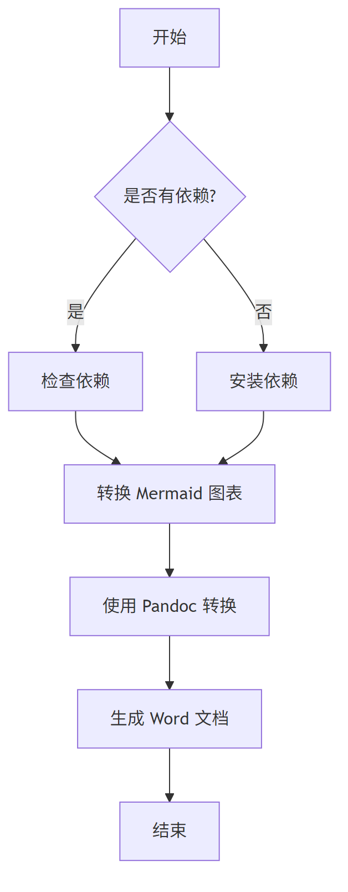
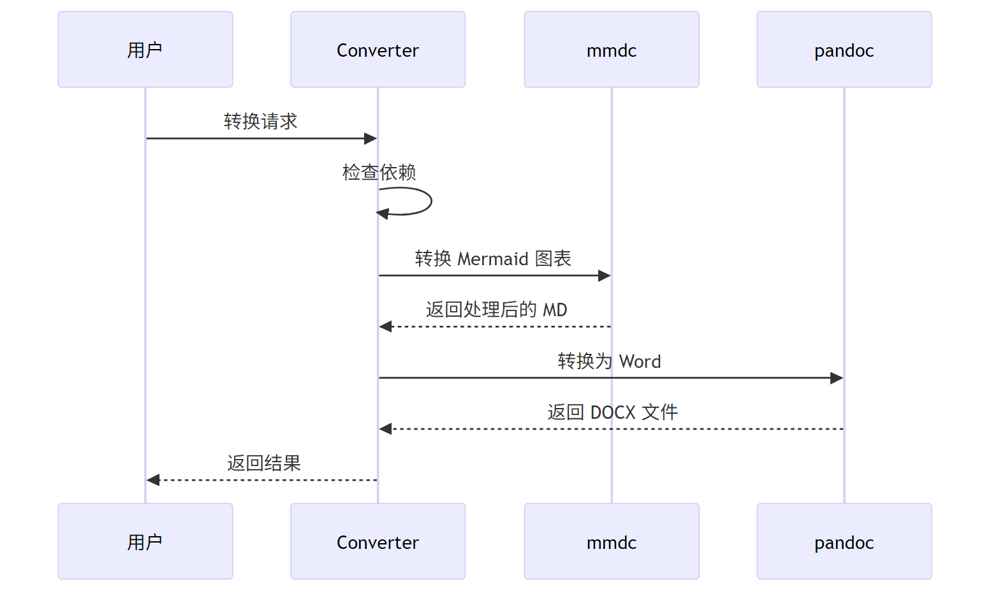

# 测试文档

这是一个用于测试 Markdown 转 Word 技能的示例文档。

## 目录

- [功能特性](#功能特性)
- [Mermaid 图表测试](#mermaid-图表测试)
- [表格测试](#表格测试)
- [代码块测试](#代码块测试)

## 功能特性

该技能支持以下功能：

1. **文本格式化** - 支持粗体、斜体、~~删除线~~等
2. **列表支持** - 有序列表和无序列表
3. **代码高亮** - 内联代码 `print("Hello World")` 和代码块
4. **表格转换** - 自动转换 Markdown 表格
5. **图表处理** - 支持 Mermaid 图表转换为图片

## Mermaid 图表测试

### 流程图



### 序列图



## 表格测试

### 工具对比

| 工具 | 功能 | 安装难度 | 平台支持 |
|------|------|----------|----------|
| Pandoc | 文档转换 | 中等 | 跨平台 |
| mmdc | 图表转换 | 简单 | 跨平台 |
| 此技能 | 集成方案 | 简单 | 跨平台 |

### 转换结果

| 步骤 | 状态 | 说明 |
|------|------|------|
| 1. 依赖检查 | ✅ | 自动检查所需工具 |
| 2. 图表转换 | ✅ | Mermaid 转 PNG |
| 3. 文档转换 | ✅ | Markdown 转 Word |
| 4. 模板应用 | ✅ | 应用自定义样式 |

## 代码块测试

### Python 示例

```python
def convert_markdown_to_word(input_file, output_file):
    """
    将 Markdown 文件转换为 Word 文档

    Args:
        input_file (str): 输入的 Markdown 文件路径
        output_file (str): 输出的 Word 文件路径
    """
    # 检查依赖
    if not check_dependencies():
        raise Exception("缺少必要的依赖工具")

    # 转换流程
    processed_md = process_mermaid_diagrams(input_file)
    convert_to_docx(processed_md, output_file)

    print(f"转换完成: {output_file}")

# 使用示例
convert_markdown_to_word("test.md", "output.docx")
```

### PowerShell 示例

```powershell
param(
    [Parameter(Mandatory=$true)]
    [string]$InputFile,

    [string]$OutputFile
)

# 检查文件是否存在
if (-not (Test-Path $InputFile)) {
    Write-Error "文件不存在: $InputFile"
    exit 1
}

# 执行转换
Write-Host "开始转换..."
& python scripts/convert.py $InputFile -o $OutputFile

if ($LASTEXITCODE -eq 0) {
    Write-Host "转换成功完成!"
} else {
    Write-Error "转换失败"
    exit 1
}
```

## 总结

这个测试文档展示了 Markdown 转 Word 技能的主要功能：

- ✅ **标题层级** - 支持多级标题和目录生成
- ✅ **文本格式** - 支持各种文本格式化选项
- ✅ **列表支持** - 有序和无序列表转换
- ✅ **表格转换** - Markdown 表格转 Word 表格
- ✅ **代码高亮** - 代码块和语法高亮
- ✅ **图表处理** - Mermaid 图表转图片嵌入
- ✅ **模板应用** - 使用自定义 Word 模板

> **注意**: 使用此技能前请确保已安装 Pandoc 和 Mermaid CLI 工具。

---

*此文档由 Markdown 转 Word 技能生成和测试*