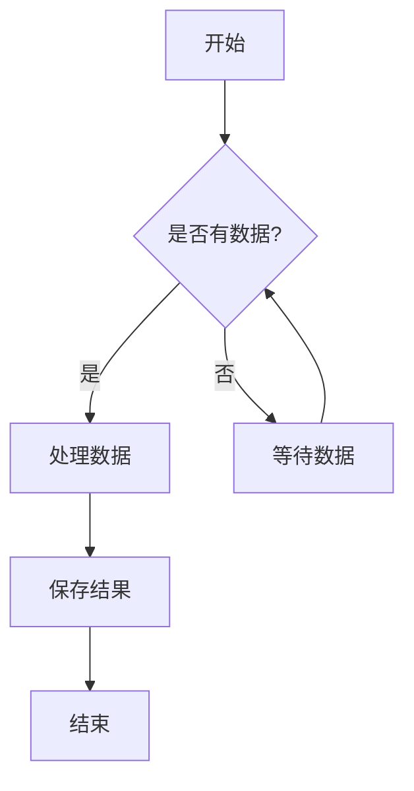
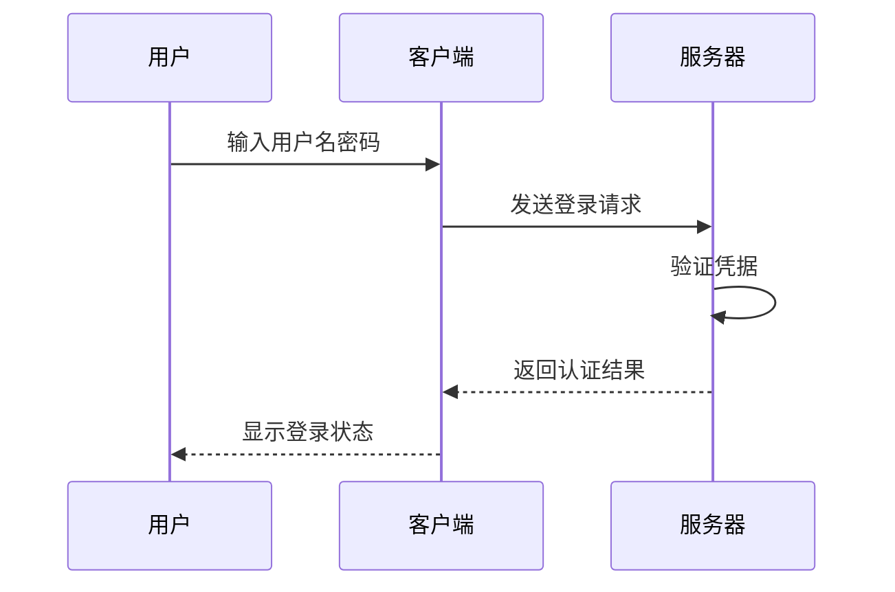
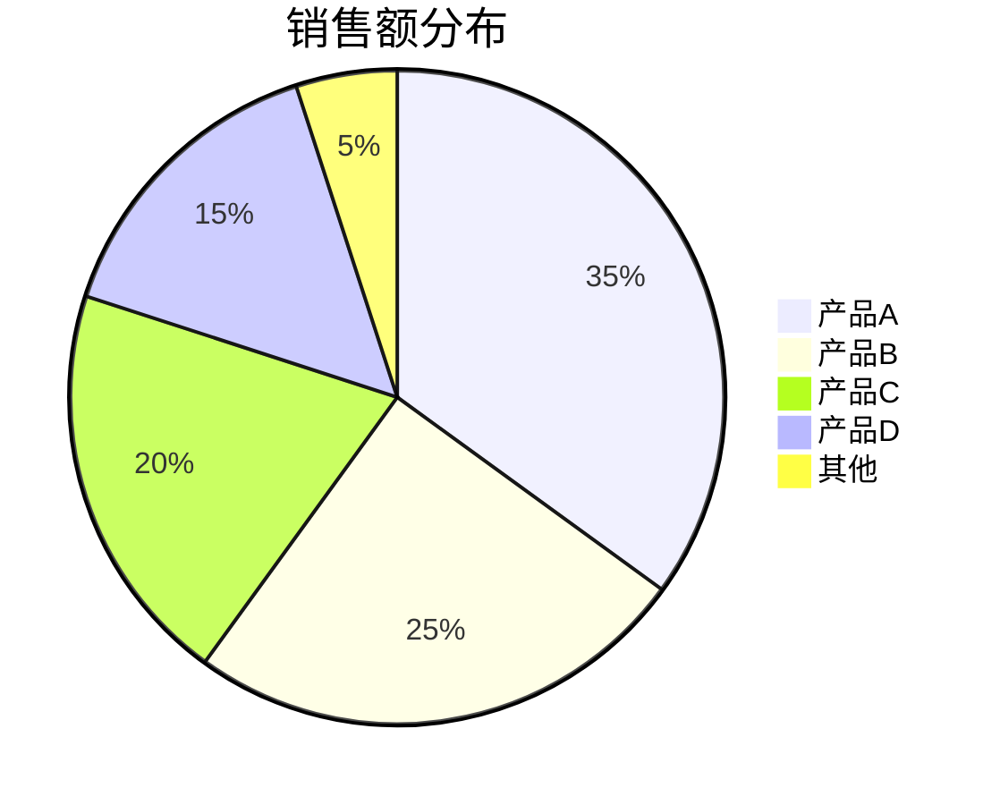
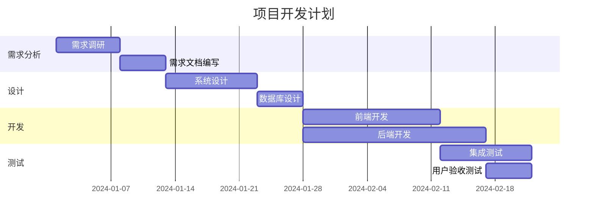
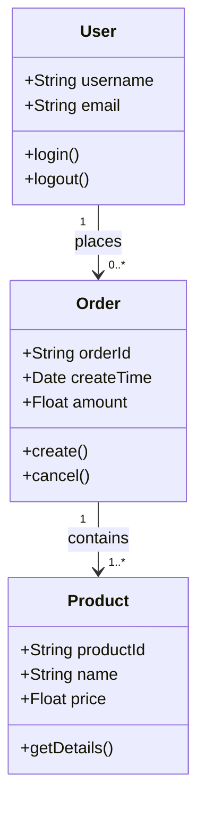

# Mermaid 图表测试文档

这是一个包含 Mermaid 图表的测试文档，用于验证 Markdown 到 Word 的转换功能。

## 1. 流程图

下面是一个简单的流程图示例：

## 2. 序列图

用户认证的序列图：

## 3. 饼图

数据统计分布图：

## 4. 甘特图

项目时间线：

## 5. 类图

系统架构类图：

## 结论

这个文档包含了多种类型的 Mermaid 图表，用于测试转换工具的兼容性。如果所有图表都能正确转换为 Word 文档中的图片，说明转换工具工作正常。